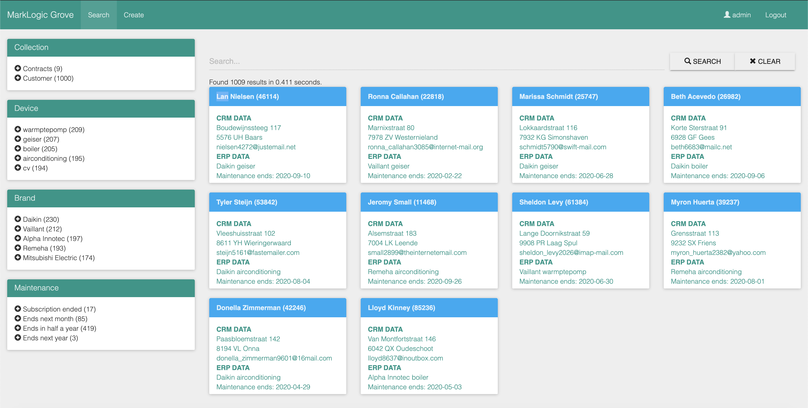

# IOT Demo
## Context and source data
This demo shows how MarkLogic and the Data Hub Framework can be used in IOT cases. There are three datasets avaiable:
- In this case, there is a company with disconnected CRM and ERP databases. Of both, there are CSV dumps available.  
- Additionally there is a feed that provides IOT data from the devices under a service contract. This data is available as JSON data.
- Furthermore the company has an ECM system that comtains contracts and documents in PDF format, relevant to the customers.

## Ingestion flows
We will create three flows:
1. The `Customer360 flow` that will ingest the CRM and ERP data and then harmonize it to a business entity Customer.
2. The `IOT flow` that will ingest the raw JSON data coming from the devices
3. The `Contracts flow` that will ingest the PDF files, convert them to machine readable text and enrich them based on the above information.  

The Customer and IOT flow have been created using the brilliant Visual Programming Plugin:


## BI Visualisation
Finally the data is provided through a Tableau dashboard showing the following information:
- The support contracts that will soon be out of date
- Customers with a critical CO level
- Device data
- A pie chart showing the distribution of device types


Additionally, there is a map view that shows the distribution of devices along with the current CO level at a glance:


## Web Visualisation
Additionally there is a HTML front-end that will allow:
- Google like searching
- Analysts to include the unstructured information from PDF.



# Deploy the demo
## Deploy Data Hub Framework into MarkLogic
From the `DHF` folder:
```sh
./gradlew mlDeploy
```

## Deploy Grove into MarkLogic
From the `Grove/marklogic` folder:
```sh
cd GUI/marklogic
./gradlew mlDeploy
```

## Install the Grove Node.js dependencies
From the `Grove` folder:
```sh
cd GUI
npm install
```

# Run the demo
## Start Datahub Quickstart
```sh
java -jar marklogic-datahub-5.0.4.war
```

## Start Visual Programming Plugin
```sh
cd visual-programming-plugin/dist_user/DesignerUI
quasar serve --proxy ../proxy_rule.js
```

## Start Grove
```sh
cd GUI
npm start
```

# Demo flow
Prepare and open the following:
- DHF (http://localhost:8080)
- VPP (http://localhost:4000)
- Grove (http://localhost:3000)
- Azure portal (https://portal.azure.com)
- Tableau (with the IOT Dashboard)
- Favorite IDE (to show the data and to update the `gradle-azure.properties`)

First explain a bit about the comapny, a utility services company, offering maintenance subscription to heatign, etc.  
Then something about the data itself: CSV, JSON and PDF coming from silo applications like ERP, CRM and the devices itself.  
The company has problems bringing all the data together in real-time to better serve their customers.  
They decided to use the turn-key, low-code Data Integration solution from MarkLogic. Lets see what they came up with!  

Login to the Data Hub Framework at http://localhost:8080 and follow these steps to demo:
- Run the `Customer360` flow to ingest and harmonize the CRM and ERP data into a Customer360 view with geocoded addresses
- Run the `DeviceData` flow to ingest the raw device JSON data into a harmonized IOT view

After this, show the VPP flows at http://localhost:4000 to explain how the data was harmonized without a letter of coding.  

Initially show the results in the Tableau dashboard  by clicking the Story `Company Dashboard`. Explain the live connection and show high CO values for instance.  
Then show the same data using the HTML front-end Grove at http://localhost:3000. Explain the Google like searching and facetting.  

Now we also want to include contractual information to pull up the right data when the Customer Contact Centre needs it:
- Run the `Contracts` flow to ingest the unstructured PDF data, enriching it with the structured data, into a Contracts collection

Again show the HTML front-end Grove with contracts being added now. Click through the enriched data in the contracts using facets.  

OK, our application is ready. Now create an Azure environment at https://portal.azure.com, update the `gradle-azure.properties` and deploy to the server environment.  

EASY PEASY!

# Appendix
## Install MarkLogic from Docker Hub
This will download and run MarkLogic from Docker Hub, storing the MarkLogic data files locally in the current directoy under `./MarkLogic`.
```sh
docker run -d -it \
    -p 8000-8020:8000-8020 \
    -v `pwd`/MarkLogic:/var/opt/MarkLogic \
    -e MARKLOGIC_INIT=true \
    -e MARKLOGIC_ADMIN_USERNAME=admin \
    -e MARKLOGIC_ADMIN_PASSWORD=admin \
    --name iot \
    store/marklogicdb/marklogic-server:10.0-2-dev-centos
```

## Ingesting contracts
In order to ingest and convert contracts to machine reabable (and therefore searchable) text, first the MarkLogic Converters need to be installed.
The installation packes can be found at https://developer.marklogic.com/products/marklogic-server/10.0 for your specific environment. Generic installation procedure to be found here: https://docs.marklogic.com/guide/installation/procedures#id_28962.

### Install into Docker container
In case of using the MarkLogic Docker image, you'll have to download and install the converters into the docker container like:
```sh
docker exec -it iot sh
curl --output /tmp/MarkLogicConverters.rpm <the url you get from developer.marklogic.com when clicking on the button to use Curl>
sudo yum install libgcc libgcc.i686 libstdc++ libstdc++.i686
sudo rpm -i /tmp/MarkLogicConverters.rpm
service MarkLogic restart
```

## Configure Visual Programming Plugin
All of the following actions are relative to the `visual-programming-plugin` folder.

### Install Quasar
Install quasar CLI.
```sh
npm install -g @quasar/cli
```

### Install the node packages
```sh
npm install
```

### Override litegraph node_modules
Make sure to override litegraph node_modules with the project one node_modules_override
```sh
cp node_modules_override/litegraph.js node_modules/litegraph.js/build/litegraph.js
```

### Point VPP to the Data Hub
Optional: update MarkLogic staging port if different from 8010.  
Proxy configuration is here: `quasar.conf.js` on line 114.

### Copy and install VPP code into the Data Hub
```sh
cp -r dist_user/DHF/src/* ../src/.
cd ..
./gradlew mlReloadModules
```

## Tail the Data Hub logfiles
It can be helpful to put a tail on the logfile of the data hub as follows:
```sh
tail -f MarkLogic/Logs/8010_ErrorLog.txt
```

## Create an ODBC endpoint
Create the file `src/main/ml-config/servers/odbc-server.json`:
```sh
{
  "server-name": "%%mlFinalAppserverName%%-odbc",
  "server-type": "odbc",
  "root": "/",
  "group-name": "%%GROUP%%",
  "port": "8014",
  "modules-database": "%%mlModulesDbName%%",
  "content-database": "%%mlFinalDbName%%",
  "authentication": "basic"
}
```

## Create indexes in data-hub-FINAL for facetting/drilldown
In file `src/main/ml-config/databases/final-database.json` add:
```sh
  "range-element-index": [
    {
      "scalar-type": "string",
      "collation": "http://marklogic.com/collation/codepoint",
      "namespace-uri": "",
      "localname": "brand",
      "range-value-positions": false,
      "invalid-values": "ignore"
    }, {
      "scalar-type": "string",
      "collation": "http://marklogic.com/collation/codepoint",
      "namespace-uri": "",
      "localname": "device_type",
      "range-value-positions": false,
      "invalid-values": "ignore"
    }
  ]
```
To load the changes, from the `DHF` folder:
```sh
./gradlew mlDeployDatabases
```

## Add collections and facets to Grove
In file `GUI/marklogic/ml-modules/options/all.xml` add:
```sh
  <additional-query>
    <cts:collection-query xmlns:cts="http://marklogic.com/cts">
      <cts:uri>Customer</cts:uri>
      <cts:uri>Contracts</cts:uri>
      <cts:uri>Device</cts:uri>
    </cts:collection-query>
  </additional-query>
```
In file `GUI/marklogic/ml-modules/options/all.xml` add:
```sh
<constraint name="Device">
<range type="xs:string" facet="true" collation="http://marklogic.com/collation/codepoint">
    <facet-option>limit=10</facet-option>
    <facet-option>frequency-order</facet-option>
    <facet-option>descending</facet-option>
    <element ns="" name="device_type"/>
</range>
</constraint>

<constraint name="Brand">
<range type="xs:string" facet="true" collation="http://marklogic.com/collation/codepoint">
    <facet-option>limit=10</facet-option>
    <facet-option>frequency-order</facet-option>
    <facet-option>descending</facet-option>
    <element ns="" name="brand"/>
</range>
</constraint>
```
To load the changes, from the `Grove/marklogic` folder:
```sh
cd GUI/marklogic
./gradlew mlReloadModules
```

## Include result data to the search results for Grove
In file `GUI/marklogic/ml-modules/options/all.xml` add:
```sh
  <extract-document-data>
    <extract-path>/envelope/instance/Customer</extract-path>
  </extract-document-data>
```
To load the changes, from the `Grove/marklogic` folder:
```sh
cd GUI/marklogic
./gradlew mlReloadModules
```

## Delete the contracts collection to start the demo over again
Using query console at http://localhost:8000 and run the following against the data-hub-FINAL database:
```javascript
'use strict';
declareUpdate();
for (var d of fn.collection("Contracts")) {
  xdmp.documentDelete(fn.baseUri(d))
}
```